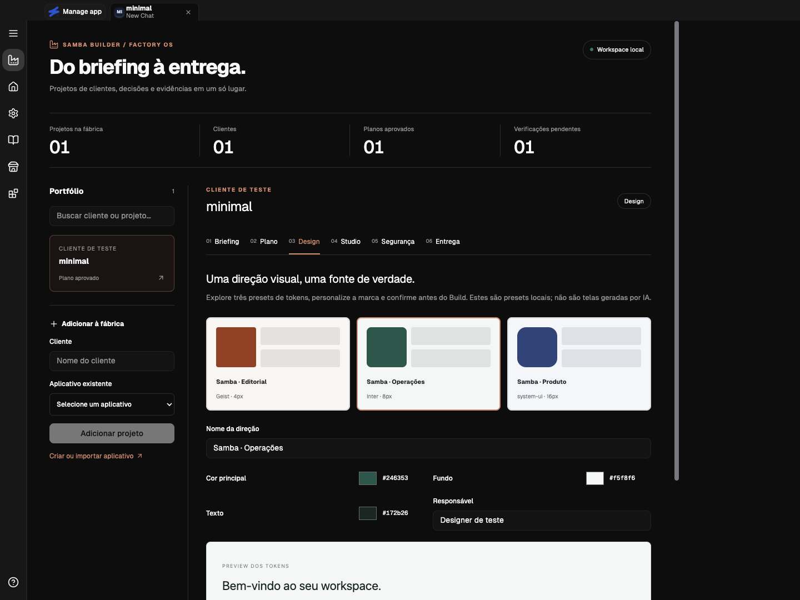
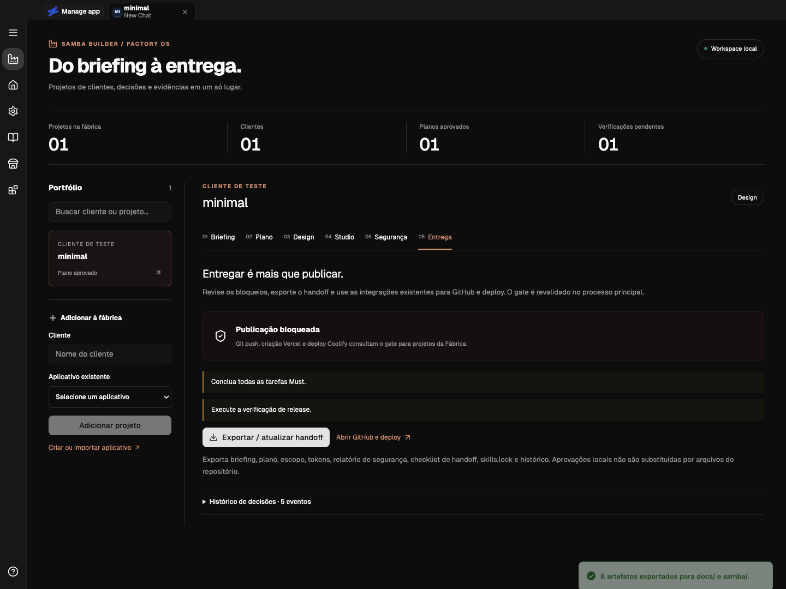

# Evidência de validação — 05/09/2026

Executado localmente em macOS arm64, Node 24.20.0.

| Verificação                                                       | Resultado                                         |
| ----------------------------------------------------------------- | ------------------------------------------------- |
| Typecheck principal e workers (`npm run ts`)                      | Aprovado                                          |
| Lint do repositório (`npm run lint`)                              | Zero erros; três avisos fora da camada de fábrica |
| Testes Vitest de fábrica, interface, preload, chat, Coolify e Git | 212 aprovados, 1 teste existente ignorado         |
| Build de E2E (`npm run build`)                                    | Pacote Electron arm64 produzido                   |
| Fluxo Playwright `samba_factory.spec.ts`                          | Aprovado                                          |
| Overflow horizontal do painel em 760px                            | Ausente no fluxo testado                          |
| `git diff --check`                                                | Aprovado                                          |

O E2E importa a fixture minimal em perfil isolado, cadastra cliente sintético, salva briefing, valida Build bloqueado, importa/salva/aprova plano, confirma tokens, verifica Build disponível, confirma gate de release bloqueado, exporta oito artefatos e reencontra a aprovação ao sair e voltar à Fábrica.

Os testes adicionais verificam conflito de revisões entre janelas e rascunho vinculado à revisão observada, falha fechada para armazenamento corrompido, recusa de links simbólicos, digest desatualizado, efeitos de scripts nas fontes, auditoria indisponível, credenciais redigidas e referências entre clientes recusadas. A publicação exige commit das alterações e o push gerido usa a branch atual.

Não foram executados LLMs pagos, deploys reais, scans de bancos de clientes, publicação de produção nem a suíte completa de milhares de testes da base. As evidências acima cobrem a implementação local descrita no README, não o PRD inteiro. O gate não atesta o commit efetivamente servido por um provedor remoto; a promoção remota imutável e verificações pós-deploy precisam integrar a próxima camada de release.
